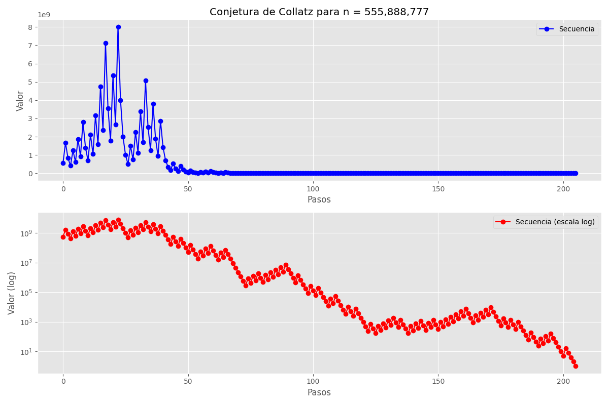
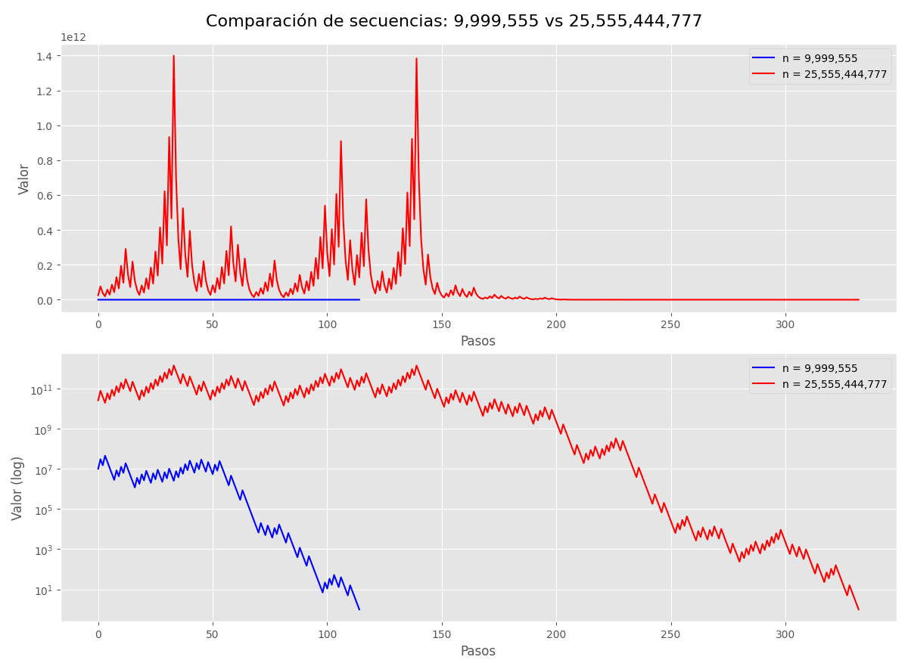

# Analizador de la Conjetura de Collatz

## Descripción

Este proyecto implementa un analizador interactivo para la Conjetura de Collatz, uno de los problemas matemáticos no resueltos más fascinantes en el campo de la teoría de números. Propuesta por el matemático Lothar Collatz en 1937, esta conjetura plantea que cualquier número entero positivo, siguiendo un conjunto específico de reglas de transformación, eventualmente alcanzará el valor 1, formando lo que se conoce como una "secuencia de Collatz" o "secuencia hailstone".

### La Conjetura

El algoritmo de la Conjetura de Collatz sigue estas simples reglas:

- **Para números pares**: El siguiente término es la mitad del valor actual (n → n/2)
- **Para números impares**: El siguiente término es el triple del valor actual más uno (n → 3n+1)
- **Condición de parada**: El proceso continua iterativamente hasta alcanzar el valor 1

A pesar de su aparente simplicidad, la conjetura sigue sin ser demostrada para todos los números enteros positivos, aunque ha sido verificada computacionalmente para valores extremadamente grandes (hasta 2^68).

### Relevancia Matemática

La Conjetura de Collatz ha intrigado a matemáticos durante décadas debido a su engañosa simplicidad y la complejidad de los patrones que genera. El legendario matemático Paul Erdős dijo sobre ella: "Las matemáticas quizás no estén preparadas para este tipo de problemas".

Este analizador permite explorar visualmente el comportamiento de las secuencias de Collatz, ofreciendo múltiples representaciones que ayudan a comprender mejor los patrones subyacentes en este fascinante problema matemático.

## Características

- **Análisis de secuencias**: Genera y analiza secuencias de Collatz para cualquier número entero positivo
- **Visualizaciones múltiples**:
  - Gráficas estáticas (lineal y logarítmica)
  - Animación interactiva con controles de reproducción
  - Visualización en espiral
  - Visualización de árbol de decisiones
- **Estadísticas detalladas**: Longitud de la secuencia, valor máximo, primeros y últimos términos
- **Comparación de secuencias**: Análisis comparativo entre dos números diferentes
- **Persistencia de datos**: Capacidad para guardar y cargar secuencias en formato JSON
- **Interfaz de usuario intuitiva**: Menú interactivo en consola


## Requisitos

- Python 3.6 o superior
- Bibliotecas:
  - matplotlib (>=3.5.0)
  - numpy (>=1.20.0)

## Instalación

El proyecto incluye un script de instalación automatizado que configura todo lo necesario:

```bash
# Clonar el repositorio
git clone https://github.com/686f6c61/Conjetura-de-Collatz.git
cd Conjetura-de-Collatz

# Ejecutar el script de instalación y ejecución
chmod +x run.sh
./run.sh
```

### Script de Automatización (run.sh)

El proyecto incluye un script de automatización (`run.sh`) que simplifica enormemente la configuración y ejecución del programa. Este script inteligente maneja todo el proceso de instalación y ejecución, permitiendo a los usuarios comenzar a utilizar el analizador con un solo comando.

#### Características del Script

- **Detección Inteligente de Python**: Identifica automáticamente la versión de Python instalada en el sistema, priorizando Python 3. Verifica la compatibilidad y proporciona mensajes claros en caso de problemas.

- **Gestión de Entornos Virtuales**: Crea y configura un entorno virtual Python aislado para el proyecto, evitando conflictos con otras instalaciones y asegurando un entorno de ejecución limpio.

- **Instalación Automática de Dependencias**: Instala todas las bibliotecas necesarias desde el archivo `requirements.txt`, con mecanismos de respaldo en caso de fallos.

- **Manejo Robusto de Errores**: Implementa estrategias alternativas cuando surgen problemas, como intentar instalaciones a nivel de usuario si falla la instalación en el entorno virtual.

- **Interfaz Visual Mejorada**: Utiliza colores y símbolos para proporcionar retroalimentación clara sobre cada paso del proceso de configuración.

- **Ejecución Automática**: Inicia la aplicación inmediatamente después de completar la configuración, sin necesidad de comandos adicionales.

#### Ejemplo de Uso

Para utilizar el script, simplemente ejecute:

```bash
./run.sh
```

El script mostrará información detallada sobre cada paso del proceso, permitiendo al usuario seguir el progreso de la configuración y diagnóstico de posibles problemas.

## Uso

### Menú Principal

El programa presenta un menú interactivo con las siguientes opciones:

1. **Analizar un número específico**: Permite ingresar cualquier número entero positivo
2. **Usar ejemplo predefinido**: Ofrece ejemplos interesantes preconfigurados
3. **Generar número aleatorio**: Crea un número aleatorio para analizar
4. **Cargar secuencia guardada**: Recupera una secuencia previamente guardada
5. **Comparar secuencias**: Analiza y compara dos secuencias diferentes
6. **Salir**: Cierra la aplicación

### Opciones de Visualización

Después de seleccionar un número para analizar, se presentan las siguientes opciones de visualización:

1. **Gráficas estáticas**: Muestra gráficas tradicionales (lineal y logarítmica)
   

2. **Animación de la secuencia**: Presenta una animación paso a paso con controles interactivos
   

3. **Visualización en espiral**: Representa la secuencia como una espiral colorida
   

4. **Visualización de árbol**: Muestra la secuencia como un árbol de decisiones
   

5. **Comparación de secuencias**: Analiza y compara dos secuencias diferentes
   

## Arquitectura del Software

El proyecto ha sido diseñado siguiendo principios sólidos de ingeniería de software, con una arquitectura modular y orientada a objetos que facilita su mantenimiento y extensibilidad.

### Diseño Orientado a Objetos

El núcleo del sistema es la clase `CollatzAnalyzer`, que encapsula toda la funcionalidad y mantiene una clara separación de responsabilidades:

- **Capa de Lógica de Negocio**: Implementa el algoritmo de Collatz con optimizaciones para manejar números extremadamente grandes y secuencias largas.

- **Capa de Visualización**: Proporciona múltiples representaciones visuales utilizando la biblioteca matplotlib, con abstracciones que permiten añadir fácilmente nuevos tipos de visualizaciones.

- **Capa de Persistencia**: Gestiona el almacenamiento y recuperación de secuencias mediante serialización JSON, permitiendo guardar resultados para análisis posteriores.

- **Capa de Interfaz de Usuario**: Implementa un sistema de menús interactivo en consola con manejo robusto de entradas y excepciones.

### Patrones de Diseño Implementados

- **Patrón Singleton**: La clase principal funciona como un punto centralizado de acceso a la funcionalidad.

- **Patrón Strategy**: Las diferentes visualizaciones implementan una interfaz común, permitiendo intercambiarlas dinámicamente.

- **Patrón Command**: Las operaciones del menú están encapsuladas como comandos independientes.

## Consideraciones Técnicas

### Manejo de Números Extremos

Uno de los mayores desafíos técnicos abordados es el procesamiento de números extremadamente grandes (hasta 10^21). El sistema implementa:

- **Aritmética de Precisión Arbitraria**: Aprovecha las capacidades nativas de Python para manejar enteros de tamaño ilimitado.

- **Optimización de Memoria**: Utiliza estructuras de datos eficientes para almacenar secuencias largas sin comprometer el rendimiento.

- **Normalización Adaptativa**: Implementa técnicas especiales para visualizar secuencias con valores que pueden variar en varios órdenes de magnitud.

### Robustez y Manejo de Errores

El sistema implementa un manejo exhaustivo de excepciones en múltiples niveles:

- **Validación de Entradas**: Verifica y sanitiza todas las entradas del usuario.

- **Recuperación Elegante**: Implementa mecanismos para recuperarse de errores sin perder el estado del programa.

- **Mensajes Informativos**: Proporciona retroalimentación clara y detallada cuando ocurren errores.

- **Manejo de Interrupciones**: Gestiona adecuadamente las interrupciones del usuario (Ctrl+C) para garantizar una salida limpia.

## Ejemplos de Uso

El analizador de la Conjetura de Collatz ofrece una API flexible que puede utilizarse tanto a través de la interfaz interactiva como programáticamente. A continuación se presentan algunos ejemplos de uso común:

### Análisis Básico de una Secuencia

```python
# Crear una instancia del analizador
analizador = CollatzAnalyzer()

# Generar y analizar la secuencia para el número 27
secuencia = analizador.analizar_collatz(27)

# La variable 'secuencia' ahora contiene la lista completa de valores
# [27, 82, 41, 124, 62, 31, ..., 4, 2, 1]
```

### Persistencia de Secuencias

#### Guardar una Secuencia para Análisis Posterior

```python
# Analizar y guardar la secuencia en un archivo JSON
analizador = CollatzAnalyzer()
secuencia = analizador.analizar_collatz(27, guardar="collatz_27.json")

# El archivo collatz_27.json contendrá la secuencia completa
# y el número inicial en formato JSON estructurado
```

#### Cargar una Secuencia Previamente Guardada

```python
# Recuperar una secuencia guardada anteriormente
analizador = CollatzAnalyzer()
numero_inicial, secuencia = analizador.cargar_secuencia("collatz_27.json")

# Ahora podemos trabajar con la secuencia recuperada
print(f"Secuencia para {numero_inicial} tiene {len(secuencia)} términos")
print(f"Valor máximo alcanzado: {max(secuencia)}")
```

### Análisis Comparativo

```python
# Generar dos secuencias diferentes
analizador = CollatzAnalyzer()
secuencia1 = analizador.collatz(27)
secuencia2 = analizador.collatz(31)

# Comparar características
print(f"Longitud secuencia 27: {len(secuencia1)}")
print(f"Longitud secuencia 31: {len(secuencia2)}")
print(f"Máximo secuencia 27: {max(secuencia1)}")
print(f"Máximo secuencia 31: {max(secuencia2)}")
```

### Visualizaciones Personalizadas

```python
# Generar una secuencia y visualizarla con diferentes métodos
analizador = CollatzAnalyzer()
secuencia = analizador.collatz(27)

# Visualización estática
analizador.mostrar_graficas(27, secuencia)

# Visualización animada
analizador.mostrar_animacion(27, secuencia)

# Visualización en espiral
analizador.mostrar_espiral(27, secuencia)
```

## Contribuciones

Las contribuciones son bienvenidas. Para contribuir:

1. Haz un fork del repositorio
2. Crea una rama para tu característica (`git checkout -b feature/nueva-caracteristica`)
3. Haz commit de tus cambios (`git commit -am 'Añadir nueva característica'`)
4. Haz push a la rama (`git push origin feature/nueva-caracteristica`)
5. Crea un nuevo Pull Request

## Licencia

Este proyecto está licenciado bajo la Licencia MIT - ver el archivo LICENSE para más detalles.

## Autor

[686f6c61](https://github.com/686f6c61)

## Repositorio

[https://github.com/686f6c61/Conjetura-de-Collatz](https://github.com/686f6c61/Conjetura-de-Collatz)

## Agradecimientos

- A los matemáticos que han investigado la Conjetura de Collatz
- A la comunidad de Python y matplotlib por sus excelentes herramientas
